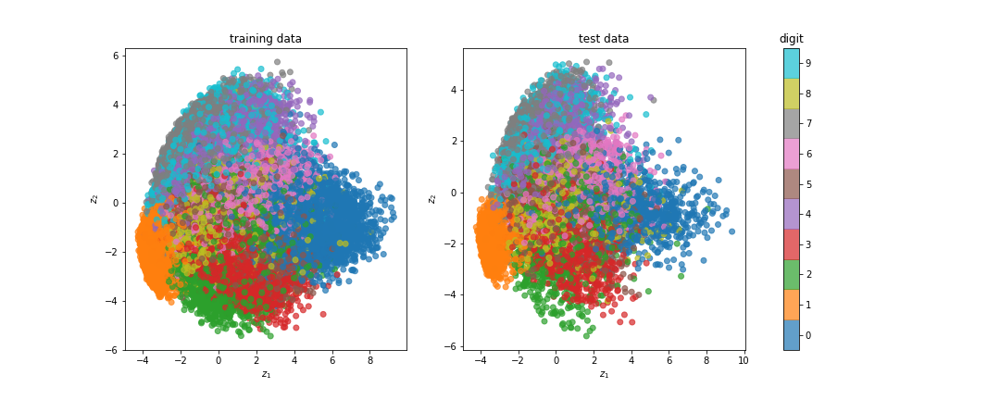
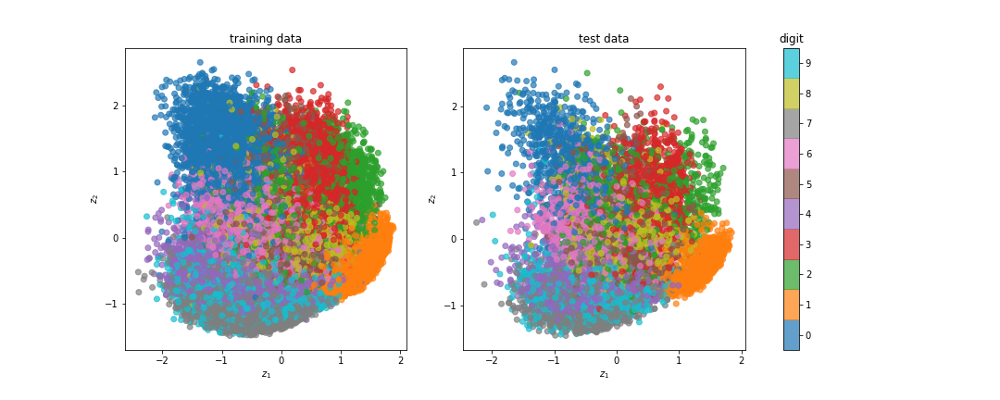
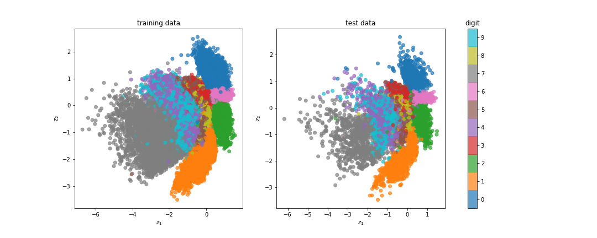
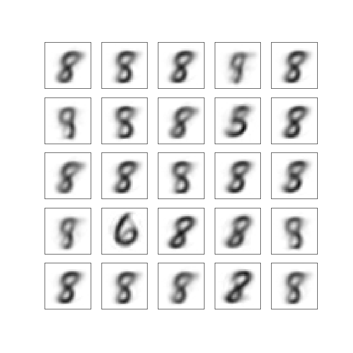

# Introduction

In this project, we implement 3 methods(**PCA, PPCA, VAE**) to do dimention reduction. Variation AutoEncoder owns best performance of reconstruction of images, as well as in generating images. 

In the experiments, we encode the high dimension images to 2 dimension, and then decode, to see the differences between them which can also be called loss function. 

Then we read a paper which attached in **paper** folder, a method called **Robust Deep AutoEncoder**(RDAE), that can be used in dimension reduction and anomaly dection.

# Experiments
We compare the result of the dimension reduction results on three model, and the results as follows: 
## PCA(2 dims) 

## PPCA(2 dims)

## VAE(2 dims)

## Conclusion
The results of the PCA and PPCA are similar, and it is also hard to split the data into different labels from the results graph. But VAE performs much better on split data into 2 dimensions since the boudaries between labels are very clear.

## Generator
Herein, we generate some images with temperature value 0.2.

